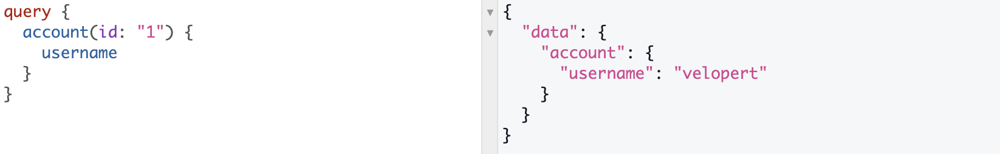

# GraphQL_study

GraphQL을 공부한 내용을 정리하는 레포지토리입니다.

## What is GraphQL?

GraphQL은 페이스북에서 만들었고 Graph QL(gql)은 Structed Query Language(sql)와 마찬가지로
**쿼리 언어**입니다.

> ### 특징

- gql과 sql의 언어적 구조 차이는 매우 큽니다.
- 또한 gql과 sql이 실전에서 쓰이는 방식의 차이도 매우 큽니다.
- sql은 데이터베이스 시스템에 저장된 데이터를 효율적으로 가져오는 것이 목적이고, gql은 **웹 클라이언트**가 데이터를 서버로 부터 효율적으로 가져오는 것이 목적입니다.
- sql의 문장(statement)은 주로 백앤드 시스템에서 작성하고 호출 하는 반면,  
  gql의 문장은 주로 **클라이언트 시스템에서 작성하고 호출** 합니다.

> ### 기본적인 문법 형태

1. sql 쿼리 예시

```sql
SELECT * FROM user where age=18;
```

2. gql 쿼리 예시

```gql
{
  user {
    name
    friends {
      name
    }
  }
}
```

서버사이드 gql 어플리케이션은 gql로 작성된 쿼리를 입력받아 쿼리를 처리한 결과를 다시 클라이언트로 돌려줍니다. HTTP API 자체가 특정 데이터베이스나 플렛폼에 종속적이지 않은것 처럼 마찬가지로 gql 역시 어떠한 특정 데이터베이스나 플렛폼에 종속적이지 않습니다.

> ### 탄생배경?

기존의 API 를 구현 할 때, 통상적으로 REST API 가 사용됩니다. 기존의 REST API 를 사용하여 API 를 구현을 한다면, 우리가 클라이언트사이드에서 어떠한 기능이 필요 할 때마다 그때 그때 새로운 API를 만들어야 했습니다. 그래서 **클라이언트가 필요한 데이터의 쿼리를 작성**하는 gql이 생겨났습니다.

## REST API와의 차이

REST API는 URL, HTTP METHOD 등을 조합하기 때문에 다양한 Endpoint가 존재 합니다. 반면, gql은 단 하나의 Endpoint만 존재 합니다. 또한, gql API에서는 원하는 데이터의 종류를 쿼리 조합을 통해서 불러옵니다. 예를 들면, REST API에서는 각 Endpoint마다 데이터베이스 SQL 쿼리가 달라지는 반면, gql API는 gql 스키마의 타입마다 데이터베이스 SQL 쿼리가 달라집니다.

- 📔endpoint: API URI처럼 요청을 구별할수 있는 것, ex) POST /posts

그림으로 보면 완벽히 이해가 됩니다.


REST API와 GraphQL API의 사용 (출처 : https://blog.apollographql.com/graphql-vs-rest-5d425123e34b)

위 그림처럼, gql API를 사용하면 여러 URI로 요청을 할 필요 없이, 하나의 URI 요청으로 처리 할 수 있습니다.

## GraphQL 구조

> ### 쿼리/뮤테이션(query/mutation)

쿼리와 뮤테이션, 응답 내용의 구조는 매우 직관적입니다. 쿼리문과 응답 내용의 구조는 거의 일치합니다.

gql에서는 굳이 쿼리와 뮤테이션을 나누는데 내부적으로 들어가면 사실상 이 둘은 별 차이가 없습니다. 쿼리는 데이터를 읽는데(R) 사용하고, 뮤테이션은 데이터를 변조(CUD) 하는데 사용한다는 개념 적인 규약을 정해 놓은 것 뿐입니다.

## gql예제 맛보기

테스트 사이트: https://graphql-tryout.herokuapp.com/graphql 및
[velopert 쿼리문 참고](https://velopert.com/2318)

## 마치며

지금은 GraphQL이 무엇인지, 어떻게 생겼는지 등 간단하게 알아보았다. 하지만 아직 쿼리&뮤테이션, 필드, 스키마&타입 등 GraphQL관련 문법(?)들이 많은데 이것은 앞으로 차차 딥하게 공부해볼것이다. 공부를 마친후 GraphQL을 적용한 코드를 짜볼것이다.

## 관련 사이트

> 참고문서

- [KaKao Tech](https://tech.kakao.com/2019/08/01/graphql-basic/)
- [velopert](https://velopert.com/2318)
- [graphQL-korea](https://graphql-kr.github.io/learn/queries/)
