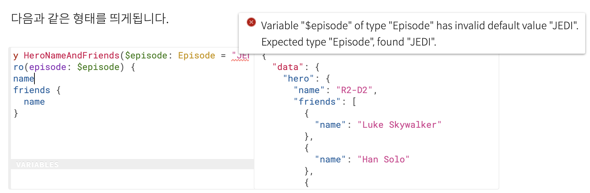

# 쿼리 & 뮤테이션

GraphQL 서버에 쿼리하는 내용을 다룬다.

## 필드

GraphQL은 객체에 대한 특정 필드를 요청하는 것이 매우 간단합니다. 아주 간간한 쿼리를 실행하여 얻는 결과의 예를 살펴 봅시다.

> 쿼리

```GraphQL
{
    developer {
        name
    }
}
```

> 결과

```GraphQL
{
    "data": {
        "developer": {
            "name": "LEEWOOCHAN"
        }
    }
}
```

쿼리와 결과가 정확히 동일한 형식인걸 볼 수 있습니다. 이것이 GraphQL의 **핵심**입니다. 클라이언트는 항상 기대한 결과를 얻을수 있습니다. 서버에서 클라이언트가 요청하는 필드를 정확히 알고있기 때문입니다.

`name`필드는 `String`타입을 반환합니다. 여기서는 제 이름인 `"LEEWOOCHAN"`을 반환했습니다.

앞의 예에서는 `String`타입인 개발자의 이름만 요청했지만 필드는 객체를 참조할 수도 있습니다. 이 경우 해당 객체가 갖는 필드를 *하위 선택*할 수 있습니다. GraphQL쿼리는 연관된 객체와 필드의 값을 얻을수 있으므로 클라이언트는 기존 REST 구조처럼 여러 URI에 요청을 수행할 필요 없이 한번의 요청으로 필요한 많은 데이터를 얻을수 있습니다.

> `필드는 객체를 참조할 수도 있습니다.` <- 이게 무슨말일까요? (저는 한참 고민했답니다.) 제가 이해한 바로는 name이라는 필드는 단순히 String 타입의 값을 갖고 예를들어 `language`라는 필드는 `Array`와 같은 타입을 갖다고 하였을때, 이때 바로 필드가 객체를 참조할수 있다는 뜻으로 받아들였습니다.

> 쿼리 예

```GraphQL
{
  developer {
    name
    # 쿼리에 주석을 쓸 수도 있습니다!
    languages {
      name
    }
  }
}
```

> 쿼리 결과 예

```GraphQL
{
  "data": {
    "developer": {
      "name": "LEEWOOCHAN",
      "languages": [
        {
          "name": "JavaScript"
        },
        {
          "name": "TypeScript"
        }
      ]
    }
  }
}
```

위 예에서, `languages` 필드는 배열을 반환합니다. GraphQL 쿼리는 `languages` 필드처럼 배열이나 `name` 필드처럼 단일 아이템의 결과를 얻는 쿼리는 동일하게 보이지만 우리는 스키마를 기반으로 봤을때 무엇이 단일 아이템이고 무엇이 배열인지 예상되는 결과를 알 수 있습니다.

## 인자

객체와 필드를 탐색할 수 있는 것만으로도 이미 GraphQL은 데이터를 가져오는데 굉장히 편리한 언어가 될 것입니다. 하지만 필드에 인자를 전달하는 기능을 추가하면, 훨씬 다양한 일을 할 수 있습니다.

> `필드에 인자를 전달하는 기능` <- 이게 무슨 말일까요? 제가 이해한 바로 필드의 속성값을 인자 값으로 주어 특정 필드를 찾아내는 기능을 할수 있다고 이해하였습니다. 그런데 테스트 해보니까 필드의 모든 속성값을 인자로 넘겨줄순 없고 ~~PK(Primary Key)? 처럼 특정 id만 인자로 쓸수 있는건가? 모르겠다...~~ 제가 예상하기론 아래 사진처럼 안되는걸 볼 수 있다. 

> 인자값이 있는 쿼리 예

```GraphQL
{
  human(id: "1000") {
    name
  }
}
```

> 인자값이 있는 쿼리 결과 예

```GraphQL
{
  "data": {
    "human": {
      "name": "LEEWOOCHAN"
    }
  }
}
```

REST와 같은 시스템에서는 요청에 쿼리 파라미터와 `URL 세그먼트` 같은 단일 인자들만 전달할 수 있습니다. 하지만 GraphQL에서는 모든 필드와 중첩된 객체가 인자를 가질 수 있으므로 GraphQL은 여러번의 API fetch를 완벽하게 대체할 수 있습니다. 필드에 인자를 전달하면, 클라이언트가 데이터를 처리하는 대신 서버에서 데이터 변환을 한 번만 구현할 수도 있습니다.

> 중첩 인자 쿼리 예

```GraphQL
{
  human(id: "1000") {
    name
    height(unit: CENTIMETER)
  }
}
```

> 중첩 인자 쿼리 결과 예

```GraphQL
{
  "data": {
    "human": {
      "name": "LEEWOOCHAN",
      "height": 170
    }
  }
}
```

인자는 다양한 타입이 될 수 있습니다. 위 예제에서는 열거형(Enumeration) 타입을 사용했습니다. 이 타입은 다양한 옵션들(이 경우에는 길이 단위 METER, CENTIMETER) 중 하나를 나타냅니다. GraphQL은 기본 타입과 함께 제공되지만, GraphQL 서버는 데이터를 직렬화 할 수 있는 한 직접 커스텀 타입을 선언할 수도 있습니다.

> 세그먼트(segment)?

간단하게 쿼리스트링 방식과 세그먼트 방식을 말하면

- 쿼리스트링 방식: example.com/board?id=2
- 세그먼트 방식: example.com/board/2

## 별칭

호기심이 많은 사람이라면 의문점을 가지셨겟지만, 쿼리 결과 객체의 필드가 쿼리의 필드 이름과 일치하지만 인자는 결과에 포함되지 않으므로(?) **같은 필드를 인자값을 다르게하여 직접 쿼리할 수는 없습니다.** 이러한 문제를 해결하기위해 필드의 결과를 원하는 이름으로 바꿀 수 있습니다. 이것이 별칭이 필요한 이유입니다.

> `인자는 결과에 포함되지 않으므로(?)` <- 이게 좀 헷갈렸는데 내가 이해한 내용은 쿼리 결과에 어떤 인자를 넘겨줬는지에 대한 정보가 없으니까 같은 필드에 대해 인자값을 다르게 넘겨주면 쿼리 결과에는 같은 키값(필드 명)으로 나오게 되니까 이렇게 되면 구별을 할수 없기때문에 문제가 생긴다는 의미로 받아들였다.

> 별칭을 이용한 쿼리 예

```GraphQL
{
  empireHero: hero(episode: EMPIRE) {
    name
  }
  jediHero: hero(episode: JEDI) {
    name
  }
}
```

> 별칭을 이용한 쿼리 결과 예

```GraphQL
{
  "data": {
    "empireHero": {
      "name": "Luke Skywalker"
    },
    "jediHero": {
      "name": "R2-D2"
    }
  }
}
```

위 예에서 두 `hero` 필드는 서로 충돌하지만, 서로 다른 이름의 별칭을 지정해주었기 때문에 한 요청에서 두 결과를 모두 얻을 수 있습니다.

## 프래그먼트

어플리케이션에서 상대적으로 복잡한 페이지가 있다고 가정해 봅시다. 친구(`freinds`)를 가진 두 영웅(`hero`)을 순서대로 요청한다고 해봅시다. 그러면 쿼리가 복잡해질 수 있습니다. 이렇게 되면 필드를 최소 두 번 반복해야 합니다.

이것이 _프래그먼트_ 라는 **재사용 가능한 단위**가 GraphQL에 포함된 이유입니다. 프래그먼트를 사용하면 필드셋(?)을 구성한 다음 필요한 쿼리에 포함시킬 수 있습니다. 다음은 프래그먼트를 사용하여 위 상황을 해결하는 예입니다.

필드셋 <- 필드에 들어갈 내용을 세팅한다라고 이해했다.

> 프래그먼트를 이용한 쿼리 예

```GraphQL
{
  leftComparison: hero(episode: EMPIRE) {
    ...comparisonFields
  }
  rightComparison: hero(episode: JEDI) {
    ...comparisonFields
  }
}

fragment comparisonFields on Character {
  name
  appearsIn
  friends {
    name
  }
}
```

> 프래그먼트를 이용한 쿼리 결과 예

```GraphQL
{
  "data": {
    "leftComparison": {
      "name": "Luke Skywalker",
      "appearsIn": [
        "NEWHOPE",
        "EMPIRE",
        "JEDI"
      ],
      "friends": [
        {
          "name": "Han Solo"
        },
        {
          "name": "Leia Organa"
        },
        {
          "name": "C-3PO"
        },
        {
          "name": "R2-D2"
        }
      ]
    },
    "rightComparison": {
      "name": "R2-D2",
      "appearsIn": [
        "NEWHOPE",
        "EMPIRE",
        "JEDI"
      ],
      "friends": [
        {
          "name": "Luke Skywalker"
        },
        {
          "name": "Han Solo"
        },
        {
          "name": "Leia Organa"
        }
      ]
    }
  }
}
```

예제 쿼리문을 보니까 이해가 됐다. 중복되는 내용의 쿼리를 프래그먼트라는 단위로 나눠서 필드에 ex) ...프래그먼트\_이름 이런 형식으로 사용을 하는것이다. 선언 방식은 ex) fragment 프래그먼트명 on 스키마(?)

필드가 반복될 경우 위 쿼리가 꽤 반복될 것을 알 수 있습니다. 프래그먼트 개념은 복잡한 응용 프로그램의 데이터 요구사항을 작은 단위로 분할하는데 사용됩니다. 특히 다른 프래그먼트와 함께 여러 UI 구성 요소를 하나의 초기 데이터 fetch로 통합해야하는 경우에 많이 사용됩니다.

> 특히 다른 프래그먼트와 함께 여러 UI 구성 요소를 하나의 초기 데이터 fetch로 통합해야하는 경우에 많이 사용됩니다. <- 무슨 뜻인지 모르겠다.

### 프래그먼트 안에서 변수 사용하기

쿼리나 뮤테이션에 선언된 변수는 프래그먼트에 접근할 수 있습니다.

> 변수 사용 쿼리 예

```GraphQL
query HeroComparison($first: Int = 3) {
  leftComparison: hero(episode: EMPIRE) {
    ...comparisonFields
  }
  rightComparison: hero(episode: JEDI) {
    ...comparisonFields
  }
}

fragment comparisonFields on Character {
  name
  friendsConnection(first: $first) {
    totalCount
    edges {
      node {
        name
      }
    }
  }
}
```

> 변수 사용 쿼리 결과 예

```GraphQL
{
  "data": {
    "leftComparison": {
      "name": "Luke Skywalker",
      "friendsConnection": {
        "totalCount": 4,
        "edges": [
          {
            "node": {
              "name": "Han Solo"
            }
          },
          {
            "node": {
              "name": "Leia Organa"
            }
          },
          {
            "node": {
              "name": "C-3PO"
            }
          }
        ]
      }
    },
    "rightComparison": {
      "name": "R2-D2",
      "friendsConnection": {
        "totalCount": 3,
        "edges": [
          {
            "node": {
              "name": "Luke Skywalker"
            }
          },
          {
            "node": {
              "name": "Han Solo"
            }
          },
          {
            "node": {
              "name": "Leia Organa"
            }
          }
        ]
      }
    }
  }
}
```

## 작업(Operation) 이름

지금까지는 `query` 키워드와 `query` 이름을 모두 생략 한 단축 문법을 사용했지만, 실제 애플리케이션에서는 코드를 덜 헷갈리게 작성하는 것이 좋습니다.

다음은 `query` 를 작업 타입, `HeroNameAndFriends` 를 작업 이름으로한 예제입니다.

> 작업 이름을 이용한 쿼리 예

```GraphQL
query HeroNameAndFriends {
  hero {
    name
    friends {
      name
    }
  }
}
```

> 작업 이름을 이용한 쿼리 결과 예

```GraphQL
{
  "data": {
    "hero": {
      "name": "R2-D2",
      "friends": [
        {
          "name": "Luke Skywalker"
        },
        {
          "name": "Han Solo"
        },
        {
          "name": "Leia Organa"
        }
      ]
    }
  }
}
```

작업 타입은 쿼리(`query`), 뮤테이션(`mutation`), 구독(`subscription`)이 될 수 있으며, 어떤 작업의 타입인지를 기술합니다.

작업 이름은 의미있고 명시적인 작업의 이름입니다. 디버깅이나 서버 측에서 로깅하는데에 매우 유용 할 수 있습니다. 네트워크 로그나 GraphQL 서버에 문제가 발생하면 내용을 확인하는 대신 코드에서 쿼리 이름을 찾아내는 것이 더 쉽습니다.

좋아하는 프로그래밍 언어의 함수명처럼 생각해보세요.

예를 들어, JavasScrip에서는 쉽게 익명 함수를 사용할 수 있지만, 함수에 이름을 부여하면 코드를 디버깅하고 호출되었을 때 로깅하는 것이 더 쉽습니다. 같은 방식으로, GraphQL 쿼리와 뮤테이션 이름과 프래그먼트 이름은 서버 측에서 Graph 요청을 식별하는데 유용한 디버깅 도구가 될 수 있습니다.

## 변수

지금까지는 모든 인자를 쿼리 문자열 안에 작성했습니다. 그러나 대부분의 응용프로그램에서 필드에 대한 인자는 **동적**입니다. 예를 들어, 어떤 스타워즈 에피소드에 관심이 있는지를 선택할 수 있는 드롭다운, 검색필드, 필터 등이 있을 수도 있습니다.

클라이언트 측 코드는 쿼리 문자열을 런타임에 동적으로 조작하고 이를 GraphQL의 특정한 포맷으로 직렬화해야하기 때문에 이러한 동적 인자를 쿼리 문자열에 직접 전달하는 것은 좋은 방법이 아닙니다. 대신 GraphQL은 동적 값을 쿼리에서 없애고, 이를 별도로 전달하는 방법을 제공합니다. 이러한 값을 _변수_ 라고 합니다.

변수를 사용하기 위해서는 다음 세 가지 작업을 해야 합니다.

1. 쿼리안의 정적 값을 `$variableName` 으로 변경합니다.
2. `$variableName` 을 쿼리에서 받는 변수로 선언합니다.
3. 별도의 통신규약(일반적으로는 JSON) 변수에 `variableName: value` 을 전달하세요.

다음과 같은 형태를 띄게 됩니다.

> 변수를 사용한 쿼리 예

```GraphQL
query HeroNameAndFriends($episode: Episode) {
  hero(episode: $episode) {
    name
    friends {
      name
    }
  }
}

# VARIABLES
{
  "episode": "JEDI"
}
```

> 변수를 사용한 쿼리 결과 예

```GraphQL
{
  "data": {
    "hero": {
      "name": "R2-D2",
      "friends": [
        {
          "name": "Luke Skywalker"
        },
        {
          "name": "Han Solo"
        },
        {
          "name": "Leia Organa"
        }
      ]
    }
  }
}
```

이제 클라이언트 코드에서 완전히 새로운 쿼리를 작성하지 않고 간단하게 다른 변수를 전달할 수 있습니다. 이는 일반적으로 쿼리의 어떤 인자가 동적인지를 나타내는 좋은 방법이기도 합니다. **사용자가 제공한 값으로 문자열을 연결해서 사용해서는 안됩니다.**

### 변수 정의

변수 정의는 위 쿼리에서 `($episode: Episode)` 부분입니다. 정적타입 언어의 함수에 대한 인자 정의와 동일합니다. `$` 접두사가 붙은 모든 변수를 나열하고 그 뒤에 타입(이 경우 `Episode`)이 옵니다.

### 변수 기본값

타입 선언 다음에 기본값을 명시하여 쿼리의 변수에 기본값을 할당할 수도 있습니다.

> 변수의 기본값을 사용한 쿼리 예

```GraphQL
query HeroNameAndFriends($episode: Episode = "JEDI") {
  hero(episode: $episode) {
    name
    friends {
      name
    }
  }
}
```

>  위 사진에서 보이듯이 디폴트 변수가 에러가 나는데 왜그런지 모르겠다.

모든 변수에 기본값이 제공되면 변수를 전달하지 않고도 쿼리를 호출할 수 있습니다. 변수가 전달되면 변수는 기본값을 덮어씁니다.

## 지시어

위에서는 동적 쿼리를 구현하기 위해 변수를 사용하여 문자열을 연결하는 작업을 피하는 방법에 대해 알아보았습니다. 인자에 변수를 전달하면 이러한 문제를 상당히 쉽게 해결할 수 있지만, 변수를 사용하여 쿼리의 구조와 형태를 동적으로 변경하는 방법이 필요할 수도 있습니다.

이러한 구성 요소에 대한 쿼리를 작성해 보겠습니다.

> 위에 해당하는 쿼리 예

```GraphQL
query Hero($episode: Episode, $withFriends: Boolean!) {
  hero(episode: $episode) {
    name
    friends @include(if: $withFriends) {
      name
    }
  }
}

# VARIABLES
{
  "episode": "JEDI",
  "withFriends": false
}
```

> 쿼리 결과 예

```GraphQL
{
  "data": {
    "hero": {
      "name": "R2-D2"
    }
  }
}
```

위 변수를 수정하여 `withFriends` 에 `true`로 변경하게 된다면 아래와 같은 결과가 나옵니다.

```GraphQL
{
  "data": {
    "hero": {
      "name": "R2-D2",
      "friends": [
        {
          "name": "Luke Skywalker"
        },
        {
          "name": "Han Solo"
        },
        {
          "name": "Leia Organa"
        }
      ]
    }
  }
}
```

`변수를 사용하여 쿼리의 구조와 형태을 동적으로 변경하는 방법이 필요할 수도 있습니다`라는 문제를 해결하기 위해서는 _지시어_ 라는 GraphQL의 새로운 기능을 사용해야 합니다. 지시어는 필드나 프래그먼트 안에 삽입될 수 있으며 서버가 원하는 방식으로 쿼리 실행에 영향을 줄 수 있습니다. 코어 GraphQL 사양에는 두 가지 지시어가 포함되어 있으며, 이는 GraphQL 서버에서 지원해야 합니다.

- `@include(if: Boolean)`: 인자가 `true` 인 경우에만 이 필드를 결과에 포함합니다.

- `@skip(if: Boolean)` 인자가 `true` 이면 이 필드를 건너뜁니다.

지시어는 쿼리의 필드를 추가하고 제거하기 위해 문자열을 조작을 해야하는 상황을 피하는데 유용할 수 있습니다. 서버에서는 새로운 지시어를 정의하여 실험적인 기능을 추가할 수도 있습니다.

# 참고 문헌

[GraphQL-kr](https://graphql-kr.github.io/learn/queries/) - https://graphql-kr.github.io/learn/queries/
