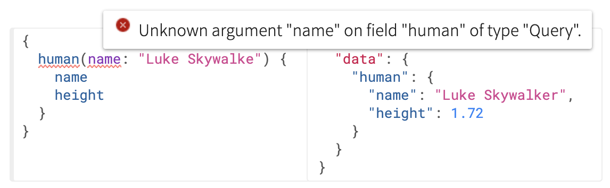

# 쿼리 & 뮤테이션

GraphQL 서버에 쿼리하는 내용을 다룬다.

## 필드

GraphQL은 객체에 대한 특정 필드를 요청하는 것이 매우 간단합니다. 아주 간간한 쿼리를 실행하여 얻는 결과의 예를 살펴 봅시다.

> 쿼리

```graph-ql
{
    developer {
        name
    }
}
```

> 결과

```graphQL
{
    "data": {
        "developer": {
            "name": "LEEWOOCHAN"
        }
    }
}
```

쿼리와 결과가 정확히 동일한 형식인걸 볼 수 있습니다. 이것이 GraphQL의 **핵심**입니다. 클라이언트는 항상 기대한 결과를 얻을수 있습니다. 서버에서 클라이언트가 요청하는 필드를 정확히 알고있기 때문입니다.

`name`필드는 `String`타입을 반환합니다. 여기서는 제 이름인 `"LEEWOOCHAN"`을 반환했습니다.

앞의 예에서는 `String`타입인 개발자의 이름만 요청했지만 필드는 객체를 참조할 수도 있습니다. 이 경우 해당 객체가 갖는 필드를 *하위 선택*할 수 있습니다. GraphQL쿼리는 연관된 객체와 필드의 값을 얻을수 있으므로 클라이언트는 기존 REST 구조처럼 여러 URI에 요청을 수행할 필요 없이 한번의 요청으로 필요한 많은 데이터를 얻을수 있습니다.

> `필드는 객체를 참조할 수도 있습니다.` <- 이게 무슨말일까요? (저는 한참 고민했답니다.) 제가 이해한 바로는 name이라는 필드는 단순히 String 타입의 값을 갖고 예를들어 `language`라는 필드는 `Array`와 같은 타입을 갖다고 하였을때, 이때 바로 필드가 객체를 참조할수 있다는 뜻으로 받아들였습니다.

> 쿼리 예

```graphQL
{
  developer {
    name
    # 쿼리에 주석을 쓸 수도 있습니다!
    languages {
      name
    }
  }
}
```

> 쿼리 결과 예

```
{
  "data": {
    "developer": {
      "name": "LEEWOOCHAN",
      "languages": [
        {
          "name": "JavaScript"
        },
        {
          "name": "TypeScript"
        }
      ]
    }
  }
}
```

위 예에서, `languages` 필드는 배열을 반환합니다. GraphQL 쿼리는 `languages` 필드처럼 배열이나 `name` 필드처럼 단일 아이템의 결과를 얻는 쿼리는 동일하게 보이지만 우리는 스키마를 기반으로 봤을때 무엇이 단일 아이템이고 무엇이 배열인지 예상되는 결과를 알 수 있습니다.

## 인자

객체와 필드를 탐색할 수 있는 것만으로도 이미 GraphQL은 데이터를 가져오는데 굉장히 편리한 언어가 될 것입니다. 하지만 필드에 인자를 전달하는 기능을 추가하면, 훨씬 다양한 일을 할 수 있습니다.

> `필드에 인자를 전달하는 기능` <- 이게 무슨 말일까요? 제가 이해한 바로 필드의 속성값을 인자 값으로 주어 특정 필드를 찾아내는 기능을 할수 있다고 이해하였습니다. 그런데 테스트 해보니까 필드의 모든 속성값을 인자로 넘겨줄순 없고 ~~PK(Primary Key)? 처럼 특정 id만 인자로 쓸수 있는건가? 모르겠다...~~ 제가 예상하기론 아래 사진처럼 안되는걸 볼 수 있다. 

> 인자값이 있는 쿼리 예

```graphQL
{
  human(id: "1000") {
    name
  }
}
```

> 인자값이 있는 쿼리 결과 예

```GraphQL
{
  "data": {
    "human": {
      "name": "LEEWOOCHAN"
    }
  }
}
```

REST와 같은 시스템에서는 요청에 쿼리 파라미터와 `URL 세그먼트` 같은 단일 인자들만 전달할 수 있습니다. 하지만 GraphQL에서는 모든 필드와 중첩된 객체가 인자를 가질 수 있으므로 GraphQL은 여러번의 API fetch를 완벽하게 대체할 수 있습니다. 필드에 인자를 전달하면, 클라이언트가 데이터를 처리하는 대신 서버에서 데이터 변환을 한 번만 구현할 수도 있습니다.

> 중첩 인자 쿼리 예

```GraphQL
{
  human(id: "1000") {
    name
    height(unit: CENTIMETER)
  }
}
```

> 중첩 인자 쿼리 결과 예

```GraphQL
{
  "data": {
    "human": {
      "name": "LEEWOOCHAN",
      "height": 170
    }
  }
}
```

인자는 다양한 타입이 될 수 있습니다. 위 예제에서는 열거형(Enumeration) 타입을 사용했습니다. 이 타입은 다양한 옵션들(이 경우에는 길이 단위 METER, CENTIMETER) 중 하나를 나타냅니다. GraphQL은 기본 타입과 함께 제공되지만, GraphQL 서버는 데이터를 직렬화 할 수 있는 한 직접 커스텀 타입을 선언할 수도 있습니다.

> 세그먼트(segment)?

간단하게 쿼리스트링 방식과 세그먼트 방식을 말하면

- 쿼리스트링 방식: example.com/board?id=2
- 세그먼트 방식: example.com/board/2

# 참고 문헌

[GraphQL-kr](https://graphql-kr.github.io/learn/queries/) - https://graphql-kr.github.io/learn/queries/
